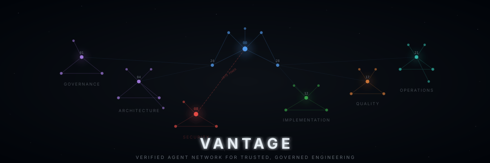

<p align="center">
  
</p>

# VANTAGE — Verified Agent Network for Trusted, Governed Engineering

A multi-agent development framework that enforces **spec-first development**, **security-by-design**, and **professional-grade architecture** across any software project.

34 specialized AI agents. 8 development phases. 4 ceremony levels. Security veto power built in. **Intelligent runtime included.**

## What is VANTAGE?

VANTAGE is a framework for orchestrating AI agents (Claude, GPT, or any LLM) through a structured software development lifecycle. Instead of letting AI write code freehand, VANTAGE enforces:

- **Specs before code** — OpenAPI, DB schemas, and wireframes are written and approved before any implementation begins
- **Security veto** — The Security Architect agent (Agent 08) can block any decision at any phase
- **Professional certifications** — Each agent operates with the knowledge of a real-world professional certification (CISSP, TOGAF, OSCP, etc.)
- **Clean Architecture** — Dependencies always point inward. Domain logic never depends on infrastructure.
- **Gate reviews** — Each phase has explicit entry/exit criteria before proceeding

## v2.0 Runtime — "Idea to MVP"

VANTAGE v2.0 adds an intelligent runtime that makes the framework dramatically more efficient:

| Module | What it does |
|--------|-------------|
| **Agent Memory** | Persistent learnings across sessions. Errors, decisions, and discoveries graduate from session to long-term memory. Automatic compaction. |
| **Two-Level Toolkits** | Lightweight index (~200 tokens) always loaded, full tool definitions (~500 tokens) loaded on-demand. 24 tools across 7 roles. |
| **OSS Scout** | Evaluation cache for packages — star ratings, license filtering, vulnerability tracking. No re-evaluating across projects. |
| **Token Estimator + Cost Tracking** | Pre-project estimation + real-time cost tracking with per-agent, per-phase ledger and dashboard. |
| **Subagent Dispatch** | Only 3 agents in main context (00, 08, 24). Everything else as subagents with fresh sessions. ~75% token reduction. |
| **Maintenance Agent** | Audits toolkit integrity, flags stale/vulnerable packages on configurable schedule. |
| **Session Lock & Recovery** | Crash recovery with stale lock detection, forensic briefing, and auto-resume guidance. |
| **Phase Skills** | 6 phase definitions with context strategy, wave execution, verification criteria, and reassessment steps. |
| **Ceremony Levels** | Quick / Standard / Full / Enterprise — scale process to match task complexity. |
| **Project State Dashboard** | Auto-generated `PROJECT-STATE.md` for rapid session orientation. |

### Quick Start (v2.0)

```bash
# Initialize in any project
npx vantage init

# Estimate token cost
node .vantage/runtime/token-estimator.js estimate --complexity medium

# Check agent memory
node .vantage/runtime/memory-manager.js load 08-security-architect

# Run maintenance audit
node .vantage/runtime/maintenance.js audit
```

## Architecture

```
Phase 0: Kickoff          → Team selection, backlog init, project scope
Phase 1: Requirements     → FR/NFR, compliance mapping, threat model
Phase 2: Architecture     → C4 diagrams, DDD boundaries, ADRs
Phase 3: Specifications   → OpenAPI, DB schema, wireframes (MUST be approved)
Phase 4: Implementation   → Code, tests, security controls
Phase 5: Review           → Code review, SAST, architecture compliance
Phase 6: Deployment       → CI/CD, observability, release
Phase 7: Maintenance      → Monitoring, incident response, improvements
```

## 34 Agents

| # | Agent | Layer | Role |
|---|-------|-------|------|
| 00 | Orchestrator | META | Entry point, phase conductor |
| 01 | Architecture Board | Governance | ADR review, architecture veto |
| 02 | Requirements Architect | Governance | FR/NFR specification |
| 03 | Compliance & Regulatory | Governance | GDPR, ISO, framework mapping |
| 04 | Enterprise Architect | Architecture | C4 models, DDD boundaries |
| 05 | Data Architect | Architecture | Domain model, ERD, data governance |
| 06 | Integration Architect | Architecture | API contracts, OpenAPI, AsyncAPI |
| 07 | Infrastructure Architect | Architecture | IaC, networking, DR |
| 08 | Security Architect | Security | STRIDE, controls matrix **(VETO POWER)** |
| 09 | IAM Agent | Security | AuthN/AuthZ, OAuth 2.1, RBAC/ABAC |
| 10 | Secrets & Crypto | Security | Encryption, vault, key rotation |
| 11 | Threat Intelligence | Security | Red team, OWASP, MITRE ATT&CK |
| 12 | Domain Logic | Implementation | Clean Arch core — entities, use cases |
| 13 | App Services | Implementation | Orchestration, DTOs, audit trails |
| 14 | Adapters | Implementation | Repositories, external clients, DB |
| 15 | Frontend Architect | Implementation | Client-side arch, CSP, state management |
| 16 | UI Builder | Implementation | Components, accessibility (WCAG) |
| 17 | Test Architect | Quality | Test strategy, coverage requirements |
| 18 | Test Implementation | Quality | Unit/integration/E2E/security tests |
| 19 | Code Review | Quality | Quality gates, architecture compliance |
| 20 | SAST Agent | Quality | OWASP Top 10, CVE scanning |
| 21 | CI/CD Agent | Operations | Pipeline, Docker, supply chain security |
| 22 | Observability Agent | Operations | Logs, metrics, alerting (SLI/SLO) |
| 23 | Documentation Agent | Operations | README, API docs, runbooks |
| 24 | Orchestrator (META) | META | Phases, gates, conflict resolution |
| 25 | Innovation Scout | META | Market intelligence, Gartner MQ analysis |
| 26 | Product Owner | Agile | Backlog ownership, value prioritization |
| 27 | Spec Writer | Agile | OpenAPI/AsyncAPI/DB schema authoring |
| 28 | Backlog Manager | Agile | Sprint management, velocity tracking |
| 29 | Release Manager | Agile | Versioning, changelog, deployment strategy |
| 30 | DevEx Engineer | Agile | Developer experience, tooling, onboarding |
| 31 | Performance Engineer | Agile | Load testing, Core Web Vitals, optimization |
| 32 | UX Researcher | Agile | User research, usability testing, accessibility |
| 33 | Data Engineer | Agile | Migrations, seeds, query optimization |

## Team Presets

| Preset | Agents | Use Case |
|--------|--------|----------|
| **Full Stack** | 00-33 | Complete application with frontend + backend |
| **API Service** | 00-14, 17-24, 26-29 | Backend API without frontend |
| **Security Audit** | 00, 01, 03, 08-11, 17, 19-20 | Security-focused review |
| **Documentation** | 00, 02, 03, 23, 26 | Documentation generation |
| **Data Pipeline** | 00, 04-07, 12-14, 17-18, 33 | Data engineering projects |
| **Frontend** | 00, 15-18, 22, 30-32 | Frontend-only applications |
| **MVP** | 00, 02, 04, 08, 12-16, 17-18, 21, 26-28 | Minimum viable product |

See [docs/team-presets.md](docs/team-presets.md) for full details.

## Repository Structure

```
agents/              34 agent system prompts (NN-agent-name.md)
docs/                Framework documentation and guides
bin/                 CLI entry point (npx vantage init)
.vantage/            v2.0 Runtime (created by npx vantage init)
├── runtime/         7 modules + 50+ tests
├── skills/          6 phase skill definitions (with context strategy + wave execution)
├── toolkits/        7 agent indices + 24 tool definitions
├── locks/           Session lock files (crash recovery)
├── memory/          Persistent agent memory + cost ledger (auto-managed)
└── config.yml       Project configuration (ceremony levels, git strategy)
```

## Quick Start

### Using with Claude Code (Recommended)

```bash
# Initialize the runtime in your project
cd your-project
npx vantage init

# The init command creates .vantage/, updates CLAUDE.md, and sets up .gitignore
# Then start with Agent 00 (Orchestrator)
```

### Using with any LLM

1. Pick a team preset from `docs/team-presets.md`
2. Load the relevant agent prompts from `agents/`
3. Append the certification context from `docs/agent-certification-map.md`
4. Start with Phase 0 (Kickoff)

For a step-by-step walkthrough, see [QUICKSTART.md](QUICKSTART.md).

## Ceremony Levels

| Level | Agents | Phases | Use Case |
|-------|--------|--------|----------|
| **Quick** | 1 (Orchestrator) | Implementation only | Bug fixes, config changes, one-file edits |
| **Standard** | Core (00, 08, 27, 28) | Kickoff → Security (light) → Impl → QA | Features within existing architecture |
| **Full** | Team preset | All 8 phases | New features, API/schema changes |
| **Enterprise** | Custom team | All 8 + compliance | Regulated industries, SOC2/HIPAA/PCI |

## Key Principles

- **No code before specs** — OpenAPI, DB schema, and wireframes must be approved first
- **Security has veto power** — Agent 08 can block any decision at any phase
- **Dependencies point inward** — Clean Architecture: Domain < Application < Infrastructure < UI
- **Every agent has a certification** — Professional-grade knowledge, not generic advice
- **Gate reviews between phases** — Explicit entry/exit criteria prevent shortcuts
- **Memory persists** — Agent learnings carry forward across sessions (v2.0)

## Documentation

| Document | Description |
|----------|-------------|
| [VANTAGE.md](docs/VANTAGE.md) | Master framework document |
| [MASTER-INVOCATION-GUIDE.md](docs/MASTER-INVOCATION-GUIDE.md) | How to invoke the framework |
| [agent-certification-map.md](docs/agent-certification-map.md) | Professional certifications per agent |
| [team-presets.md](docs/team-presets.md) | Team configurations by project type |
| [spec-templates.md](docs/spec-templates.md) | OpenAPI, DB schema, wireframe templates |
| [backlog-guide.md](docs/backlog-guide.md) | Markdown-native backlog management |
| [DECISIONS-TEMPLATE.md](docs/DECISIONS-TEMPLATE.md) | Architecture Decision Record format |
| [QUICKSTART.md](QUICKSTART.md) | Getting started guide |

## License

MIT - see [LICENSE](LICENSE).

## Contributing

See [CONTRIBUTING.md](CONTRIBUTING.md) for guidelines on adding agents, improving docs, and submitting PRs.
