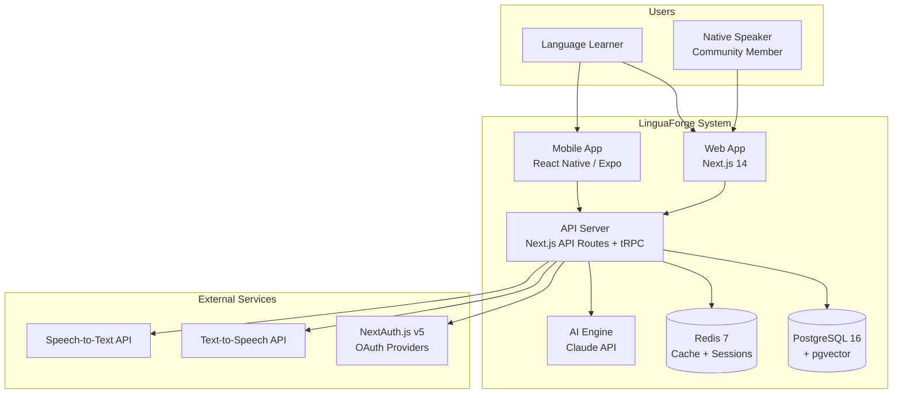
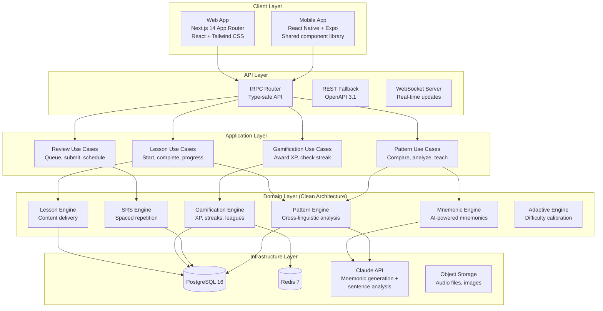

# LinguaForge — Architecture Document

> Phase 2 — Architecture
> Agents: 04-Solution Architect + 05-Domain Architect
> Status: APPROVED

## C4 System Context



## C4 Container Diagram



## Clean Architecture Layers

```
┌─────────────────────────────────────────────────────┐
│                    UI / Presentation                  │
│  Next.js Pages, React Components, React Native       │
│  ─────────────────────────────────────────────────── │
│                    Application                        │
│  Use Cases, DTOs, Ports (interfaces)                 │
│  ─────────────────────────────────────────────────── │
│                    Domain (ZERO DEPS)                 │
│  Entities, Value Objects, Domain Events,             │
│  Pattern Engine, SRS Algorithm, Gamification Rules   │
│  ─────────────────────────────────────────────────── │
│                    Infrastructure                     │
│  PostgreSQL Repos, Redis Cache, Claude API Client,   │
│  NextAuth Adapter, S3 Storage                        │
└─────────────────────────────────────────────────────┘

Dependencies point INWARD only:
  UI → Application → Domain ← Infrastructure
```

## Tech Stack Decisions

| Layer | Technology | Rationale |
|-------|-----------|-----------|
| **Frontend** | Next.js 14 (App Router) | SSR for SEO, RSC for performance, shared with API |
| **Mobile** | React Native + Expo | Code sharing with web, rapid iteration |
| **API** | tRPC + REST fallback | Type-safe end-to-end, REST for mobile/third-party |
| **Database** | PostgreSQL 16 + pgvector | Relational data + vector embeddings for semantic search |
| **Cache** | Redis 7 | Session store, leaderboard caching, rate limiting |
| **ORM** | Drizzle ORM | Type-safe, lightweight, excellent PostgreSQL support |
| **Auth** | NextAuth.js v5 | OAuth 2.1, JWT sessions, social login |
| **AI** | Claude API | Mnemonic generation, sentence analysis, pattern detection |
| **Testing** | Vitest + Playwright | Fast unit tests + E2E cross-browser testing |
| **Styling** | Tailwind CSS + Radix UI | Utility-first + accessible component primitives |

## Key Domain Modules

### Pattern Engine
The core innovation. Analyzes sentence structures across language pairs and identifies transferable patterns.

**Responsibilities:**
- Parse sentences into annotated token structures
- Compare L1↔L2 sentence structures
- Identify applicable cross-linguistic patterns
- Calculate difficulty based on language distance + user profile
- Generate pattern-specific exercises

**Dependencies:** None (pure domain logic)
**Used by:** Lesson Engine, Exercise Generator, Mnemonic Engine

### Spaced Repetition Engine (LFAR Algorithm)
Modified SM-2 with cross-linguistic weighting.

**Key enhancement:** The `crossLinguisticWeight` parameter adjusts review intervals based on whether the item involves positive transfer (longer intervals) or negative transfer (shorter intervals). False friends get the shortest intervals due to their deceptive nature.

### Gamification Engine
Event-driven system that reacts to learning activities.

**Event flow:**
```
LessonCompleted → [XP Calculator] → [Streak Checker] → [League Updater]
                                   → [Achievement Evaluator]
                                   → [Progress Tracker]
```

### Mnemonic Engine
AI-augmented mnemonic generation.

**Process:**
1. Analyze word/pattern relationship between L1 and L2
2. Identify mnemonic type (cognate bridge, phonetic link, etc.)
3. Generate via Claude API with language-pair-specific prompts
4. Store with effectiveness score
5. Community rating adjusts visibility

## Data Flow: Lesson Completion

```
User completes lesson
  │
  ├─→ Score exercises → Calculate accuracy
  │     └─→ Update pattern mastery levels
  │     └─→ Detect error patterns (3+ on same category)
  │
  ├─→ Award XP
  │     ├─→ Base XP (15)
  │     ├─→ Perfect score bonus (+5)
  │     ├─→ Speed bonus (+3)
  │     ├─→ Hard mode bonus (+10)
  │     └─→ Check level-up threshold
  │
  ├─→ Update streak
  │     ├─→ Extend or start new
  │     ├─→ Check milestone achievements
  │     └─→ Update league weekly XP
  │
  ├─→ Generate review cards
  │     ├─→ New vocabulary → cards with CLW
  │     ├─→ New patterns → pattern review cards
  │     └─→ Errors → priority review cards (short interval)
  │
  └─→ Evaluate achievements
        └─→ Emit notifications for new unlocks
```

## Deployment Architecture

```
                    ┌──────────────┐
                    │   Vercel      │
                    │   (Frontend)  │
                    └──────┬───────┘
                           │
              ┌────────────┴────────────┐
              │     Vercel Edge         │
              │  (API Routes + tRPC)    │
              └──────┬──────┬───────────┘
                     │      │
            ┌────────┘      └────────┐
            │                        │
    ┌───────▼──────┐     ┌───────────▼──┐
    │  Neon         │     │  Upstash     │
    │  PostgreSQL   │     │  Redis       │
    └──────────────┘     └──────────────┘
```

## Security Considerations (Phase 3 Input)

- All API endpoints require authentication (JWT via NextAuth)
- Rate limiting on AI generation endpoints (mnemonic, pattern analysis)
- Input sanitization on user-submitted text (exercise answers, community mnemonics)
- RBAC for community features (moderation, flagging)
- Encrypted PII at rest (email, learning data)
- GDPR compliance for EU users (data export, deletion)
