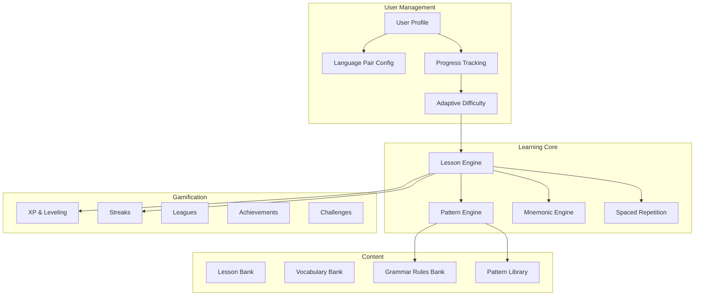

# LinguaForge — Domain Model

> Spec Reference: Phase 1 — Discovery & Specs
> Agent: 05-Domain Architect + 27-Spec Writer
> Status: APPROVED

## Bounded Contexts



## Core Domain Entities

### 1. LanguagePair (Value Object)
The fundamental unit — every learning path is defined by an L1→L2 pair.

```typescript
interface LanguagePair {
  sourceLanguage: LanguageCode;   // ISO 639-1 (e.g., "es")
  targetLanguage: LanguageCode;   // ISO 639-1 (e.g., "en")
  familyRelation: FamilyRelation; // "same_family" | "distant" | "unrelated"
  difficultyCoefficient: number;  // 0.0-1.0 based on FSI difficulty ratings
  sharedRoots: number;            // % of cognates between the pair
}
```

### 2. CrossLinguisticPattern (Aggregate Root)
The core innovation — maps structural patterns between L1 and L2.

```typescript
interface CrossLinguisticPattern {
  id: PatternId;
  pair: LanguagePair;
  category: PatternCategory;
  // "word_order" | "conjugation" | "gender_system" | "tense_mapping"
  // "article_usage" | "preposition" | "phonetic" | "cognate" | "false_friend"

  sourceStructure: SentenceStructure;  // How L1 expresses this
  targetStructure: SentenceStructure;  // How L2 expresses this
  transformationRule: TransformRule;    // The mapping between them

  difficultyLevel: 1 | 2 | 3 | 4 | 5;
  commonErrors: string[];              // Typical mistakes L1 speakers make
  mnemonicHints: string[];             // Memory aids for this pattern
  examples: PatternExample[];          // Concrete sentence pairs
}
```

### 3. SentenceStructure (Value Object)
Decomposes sentences into annotated structural components.

```typescript
interface SentenceStructure {
  raw: string;                        // "El gato negro duerme"
  tokens: AnnotatedToken[];           // [{word: "El", role: "article", ...}]
  structure: GrammarSlot[];           // [ARTICLE, NOUN, ADJECTIVE, VERB]
  wordOrder: WordOrderPattern;        // SVO, SOV, VSO, etc.
  tense: TenseInfo;
  mood: MoodInfo;
}

interface AnnotatedToken {
  word: string;
  lemma: string;                      // Dictionary form
  role: GrammaticalRole;              // "subject" | "verb" | "object" | "modifier" | ...
  partOfSpeech: PartOfSpeech;
  gender?: GrammaticalGender;
  number?: GrammaticalNumber;
  conjugation?: ConjugationInfo;
  cognateInL1?: string | null;        // If this word has a cognate
  isFalseFriend?: boolean;
}
```

### 4. Lesson (Aggregate Root)
A single learning unit combining patterns, vocabulary, and exercises.

```typescript
interface Lesson {
  id: LessonId;
  pair: LanguagePair;
  module: ModuleId;
  level: CEFRLevel;                   // A1, A2, B1, B2, C1, C2
  title: LocalizedString;
  objectives: LearningObjective[];
  patterns: CrossLinguisticPattern[];
  vocabulary: VocabularyItem[];
  exercises: Exercise[];
  estimatedMinutes: number;
  xpReward: number;
}
```

### 5. Exercise (Entity)
Interactive practice activities.

```typescript
type Exercise =
  | TranslationExercise          // Translate sentence L1→L2 or L2→L1
  | PatternMatchExercise         // Identify the pattern in a sentence
  | FillInTheBlankExercise       // Complete missing word
  | WordOrderExercise            // Drag words into correct order
  | ListeningExercise            // Listen and transcribe
  | SpeakingExercise             // Pronunciation practice
  | StructureComparisonExercise  // Map L1 structure to L2 structure
  | MnemonicRecallExercise       // Recall using mnemonic hint
  | CognateDetectionExercise     // Identify true vs false cognates
  | ContextualUsageExercise;     // Choose correct form in context

interface BaseExercise {
  id: ExerciseId;
  type: ExerciseType;
  difficulty: 1 | 2 | 3 | 4 | 5;
  pattern?: PatternId;           // Pattern being practiced
  xpValue: number;
  hints: Hint[];
  timeLimit?: number;            // seconds (optional)
}
```

### 6. UserProgress (Aggregate Root)
Tracks all learning state per user per language pair.

```typescript
interface UserProgress {
  userId: UserId;
  pair: LanguagePair;
  currentLevel: CEFRLevel;
  xp: number;
  totalXp: number;
  streak: StreakInfo;
  league: LeagueInfo;

  // Pattern mastery tracking
  patternMastery: Map<PatternId, MasteryLevel>;
  // "unseen" | "introduced" | "practicing" | "familiar" | "mastered"

  // Spaced repetition state
  reviewQueue: ReviewCard[];
  nextReviewAt: Date;

  // Adaptive difficulty
  errorPatterns: ErrorPattern[];    // What the user struggles with
  strongPatterns: PatternId[];      // What comes naturally (L1 transfer)

  // Stats
  lessonsCompleted: number;
  exercisesCompleted: number;
  accuracy: number;                 // rolling average
  studyTimeMinutes: number;
}
```

### 7. Mnemonic (Entity)
Memory aids generated from cross-linguistic analysis.

```typescript
interface Mnemonic {
  id: MnemonicId;
  type: MnemonicType;
  // "cognate_bridge"     — Uses shared Latin/Greek roots
  // "phonetic_link"      — Sound similarity across languages
  // "visual_association" — Image-based memory aid
  // "story_hook"         — Narrative connecting L1→L2
  // "false_friend_alert" — Warns about deceptive similarities
  // "grammar_rhyme"      — Rhyming rule for grammar patterns
  // "acronym"            — First-letter memory device
  // "cultural_bridge"    — Uses cultural knowledge to anchor meaning

  targetWord: string;
  targetLanguage: LanguageCode;
  sourceLanguage: LanguageCode;
  content: string;                  // The actual mnemonic text
  explanation: string;              // Why this works
  effectiveness: number;            // 0-1 based on user feedback
  userRating?: 1 | 2 | 3 | 4 | 5;
}
```

## Domain Events

| Event | Trigger | Consumers |
|-------|---------|-----------|
| `LessonCompleted` | User finishes all exercises | XP, Streak, Progress, Analytics |
| `PatternMastered` | MasteryLevel → "mastered" | Achievement, Mnemonic retirement |
| `StreakExtended` | Daily practice completed | Gamification, Notifications |
| `StreakBroken` | Day missed without freeze | Gamification, Re-engagement |
| `LeaguePromoted` | Weekly XP rank qualifies | Leaderboard, Achievement |
| `LevelUp` | XP threshold crossed | Unlock new content, Achievement |
| `ErrorPatternDetected` | 3+ errors on same pattern | Adaptive difficulty, Review queue |
| `MnemonicRated` | User rates a mnemonic | Mnemonic effectiveness tuning |
| `AchievementUnlocked` | Criteria met | Notifications, Profile |
| `ReviewDue` | Spaced repetition timer | Review queue, Notifications |

## CEFR Level Progression

```
A1 (Beginner)       → Basic patterns, high-frequency cognates, survival phrases
A2 (Elementary)     → Simple sentence structures, present tense patterns, common verbs
B1 (Intermediate)   → Complex sentences, past/future tenses, subjunctive intro
B2 (Upper-Int)      → Idiomatic expressions, nuanced grammar, false friends mastery
C1 (Advanced)       → Native-like structures, register variation, cultural nuance
C2 (Mastery)        → Edge cases, literary language, dialect awareness
```
